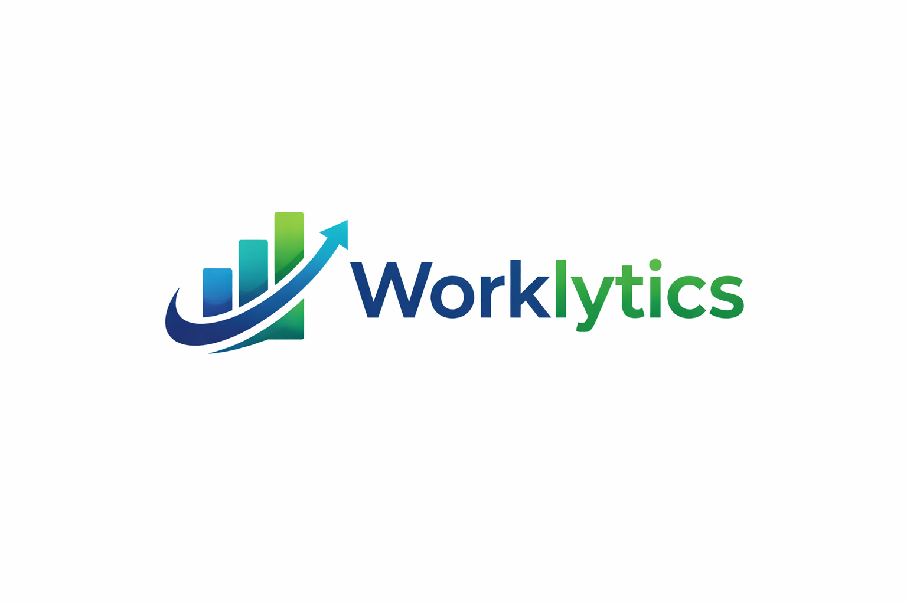

<p align="center">
  
</p>

<h1 align="center">Worklytics</h1>

<p align="center">
  <b>Saudization & Payroll Intelligence Dashboard</b><br/>
  Enterprise-ready React platform for compliance, workforce analytics, payroll visibility, and HR operations.
</p>

<p align="center">
  
  
  
  
</p>

---

## ✨ Highlights

- 🔐 Role-based authentication (`admin`, `hr`, `manager`)
- 📊 Live Saudization KPI dashboard with filtering + export
- 👥 HR module screens (Employees, Payroll, Attendance, Compliance, Reports)
- 🤖 Smart HR Copilot assistant widget
- ⚡ Embedded mock API via Vite middleware (no separate backend needed)

This project provides:
- Role-based login and session restore
- Saudization KPI dashboard with filters and exports
- HR module screens (Employees, Payroll, Attendance, Compliance, Approvals, Reports)
- Embedded mock API layer in Vite (no separate backend needed for local demo)
- Smart HR Copilot as a floating widget/popup

---

## 1) Product Overview

The system helps HR leaders and operations teams answer key questions quickly:
- Are we on target for Saudization by team?
- Which departments are at risk today?
- How many local hires are needed to recover compliance?
- What is payroll impact and hiring pressure?

It replaces fragmented spreadsheets with a real-time, interactive workspace.

---

## 2) Core Features

### Authentication & Access
- Login with role-based users (`admin`, `hr`, `manager`)
- Token issuance and verification via Vite middleware
- Session persistence in `localStorage`
- Manager scoping (manager sees only own department where applicable)

### Dashboard Analytics
- KPI cards: headcount, localization, payroll, vacancies, coverage
- Interactive controls: search, compliance filter, sort, vacancy toggle
- Adjustable localization target slider
- Department table with recommended local hires
- Workforce insight notes and action guidance
- CSV export for the currently filtered dataset

### Charts & Modules
- Recharts-based bar + pie visualization
- Payroll Run Center summary
- HR Operations snapshot
- Hiring queue planning panel
- Dedicated screens for Employees/Payroll/Attendance/Compliance/Reports

### Odoo-Style Workflow Added
- **Approvals Workflow module** for Leave and Payroll Exception requests
- Pending requests can be **Approved/Rejected** directly in UI
- Priority/status tracking with operational badges

### Smart HR Copilot Widget
- Floating launcher (bottom-right)
- Popup with health score, risk signals, and 7-day action plan
- Lightweight interactions and responsive behavior

---

## 3) Technology Stack

- **Frontend:** React 19 + Vite 8
- **Charting:** Recharts
- **Styling:** Custom CSS (`src/App.css`, `src/index.css`)
- **Dev API:** Custom Vite middleware plugin in `vite.config.js`
- **Data source:** JSON files in `dummy-db/` + fallback mock data in `src/data/`

---

## 4) Project Structure

```text
src/
  components/
    auth/LoginForm.jsx
    dashboard/
      DashboardScreen.jsx
      DashboardHeader.jsx
      DashboardControls.jsx
      KpiGrid.jsx
      WorkforceCharts.jsx
      DepartmentTable.jsx
      ComplianceInsights.jsx
      HRPayrollModules.jsx
      ModuleScreens.jsx
      SmartInsightsAssistant.jsx
  hooks/
    useAuth.js
    useDashboardData.js
    useDashboardViewModel.js
    useHrModulesData.js
  data/
    mockDashboardData.js
    mockHrModulesData.js
  App.jsx
  App.css
  index.css

dummy-db/
  users.json
  dashboard.json
  employees.json
  payroll.json
  attendance.json
  compliance.json
  reports.json

vite.config.js  (React + embedded API plugin)
```

---

## 5) How the App Works (Flow)

1. **App bootstrap** (`src/App.jsx`):
   - Calls `useAuth()`
   - Shows login if no token/user
   - Shows dashboard once authenticated

2. **Authentication flow** (`src/hooks/useAuth.js`):
   - `POST /api/auth/login` with email/password
   - Receives signed token + role metadata
   - Restores session using `GET /api/auth/me`

3. **Dashboard data flow**:
   - `useDashboardData()` loads `/api/dashboard` (polling every 15s by default)
   - `useDashboardViewModel()` computes rates, compliance flags, recommendations, KPIs, CSV export

4. **HR module data flow**:
   - `useHrModulesData()` fetches employees/payroll/attendance/compliance/reports in parallel
   - Falls back to mock data if API fails

5. **Access control**:
   - API middleware validates token and role
   - Manager is restricted by department for scoped endpoints

---

## 6) API Endpoints (Local Middleware)

Defined in `vite.config.js`:

- `POST /api/auth/login`
- `GET /api/auth/me`
- `GET /api/dashboard`
- `GET /api/employees`
- `GET /api/payroll`
- `GET /api/attendance`
- `GET /api/compliance`
- `GET /api/reports`
- `GET /api/approvals`

All non-auth endpoints require `Authorization: Bearer <token>`.

---

## 7) Demo Credentials

From `dummy-db/users.json`:

- **Admin:** `admin@worklytics.com` / `ADMIN#12345`
- **HR:** `hr@worklytics.com` / `HR#12345`
- **Manager:** `manager@worklytics.com` / `MGR#12345`

---

## 8) Setup & Run

### Prerequisites
- Node.js 18+
- npm 9+

### Install
```bash
npm install
```

### Run development server
```bash
npm run dev
```

### Build production
```bash
npm run build
```

### Preview production build
```bash
npm run preview
```

---

## 9) Configuration

Optional environment variables:

- `DASHBOARD_AUTH_SECRET` (signing secret for auth token)
- `VITE_DASHBOARD_API_URL` (default: `/api/dashboard`)
- `VITE_DASHBOARD_POLL_MS` (default: `15000`)

---

## 10) Documentation + Pitch Pack

Detailed project documentation and business pitch are available in:

- `docs/PROJECT_DOCUMENTATION_AND_PITCH.md`

This includes architecture, module-level explanation, business value proposition, implementation roadmap, and a ready stakeholder pitch narrative.

---

## 11) Recommended Next Enhancements

- Real backend (Node/Nest/Express) + database
- SSO (Azure AD/Okta) and RBAC expansion
- Arabic localization and bilingual UI
- PDF reporting and scheduled email digests
- Predictive compliance and hiring forecast models

